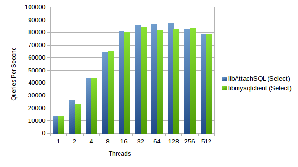

libAttachSQL Benchmarks With Sysbench
=====================================

This week I have been spending a little bit of time creating a module for `Sysbench <https://launchpad.net/sysbench>`_ so that it can use `libAttachSQL <http://libattachsql.org/>`_ as a database driver.  The reason for doing this is twofold:

1. `Brian <http://krow.net/>`_ (my boss at HP's Advanced Technology Group) said now would be a good time to benchmark libAttachSQL
2. I really needed more than a few basic queries to shake out bugs in the library, and a benchmark is a good way to shove a few million through it

On the bug front, it did find a total of 5 bugs, a couple of them serious.  Which is great, the more testing and bug finding the better.  These have all been fixed in `GitHub <http://github.com/libattachsql/libattachsql>`_ and will be part of the upcoming 0.5.0 release.

The Test Setup
--------------

To benchmark I used an HP Z620, 6-core Xeon with 16GB RAM and an SSD.  The OS was Antergos Linux (Arch with a nicer theme) and the server was MySQL 5.6.20 compiled from source.  The only real tweaks I've made to the out-of-box config that would make any difference are:

.. code-block:: ini

   innodb_buffer_pool_size=3G
   innodb_locks_unsafe_for_binlog=1
   innodb_buffer_pool_instances=8
   thread_cache=256
   query_cache_type=0
   query_cache_size=0
   max_connections=20020
   max_user_connections=20000

The `Sysbench in libAttachSQL's GitHub <https://github.com/libattachsql/sysbench>`_ was used which just has the additional driver for libAttachSQL.  Once I'm 100% happy with the driver I offer it as an upstream branch.  libAttachSQL master is used, partly due to the bug fixes and partly because there has been a large API change in master for improved error handling.

For both libmysqlclient and libAttachSQL the connections were made using Unix Domain Sockets.  For the sysbench setup I just left it at the default number of rows.  The Sysbench driver for libAttachSQL enables the semi-blocking mode which is better performance for single-connection-per-thread applications.

Select Test
-----------

First the basic select test was run, which queries for random single integers in a table.  This was run with the MySQL driver as follows:

.. code-block:: bash

   sysbench --test=sysbench/tests/db/select.lua --db-driver=mysql --mysql-socket=/tmp/mysql.sock --mysql-user=test --mysql-password=test --mysql-db=testdb --num-threads=8 --max-requests=1000000 run

And libAttachSQL:

.. code-block:: bash

   sysbench --test=sysbench/tests/db/select.lua --db-driver=attachsql --attachsql-socket=/tmp/mysql.sock --attachsql-user=test --attachsql-password=test --attachsql-db=testdb --num-threads=8 --max-requests=1000000 run

The results were as follows:

I am pretty impressed with these results so far, since I have done no optimisation work on the code.  I originally wanted the first GA to have performance on-par with libmysqlclient and it looks like that goal has been met.

Select Random Points
--------------------

I used the "Select Random Points" benchmark because it is one of the only ones that comes with Sysbench which uses Prepared Statements.  It selects 10 random integers from a table per query.

As before this was run on using libmysqlclient with:

.. code-block:: bash

   sysbench --test=sysbench/tests/db/select_random_points.lua --db-driver=mysql --mysql-socket=/tmp/mysql.sock --mysql-user=test --mysql-password=test --mysql-db=testdb --num-threads=8 --max-requests=1000000 run

And with libAttachSQL:

.. code-block:: bash

   sysbench --test=sysbench/tests/db/select_random_points.lua --db-driver=attachsql --attachsql-socket=/tmp/mysql.sock --attachsql-user=test --attachsql-password=test --attachsql-db=testdb --num-threads=8 --max-requests=1000000 run

The results were as follows:

.. image:: ../../../_static/select_random_points_benchmark.png

Again there isn't a lot in it.  libmysqlclient is edging slightly over libAttachSQL in most of this chart.  I believe it is because in the libAttachSQL driver I told it to convert all results to string outputs.  This will add additional overhead.  Next week I will tweak the driver to make sure that the conversion isn't done.

Conclusion
----------

I'm very happy with these Sysbench tests because not only has it bashed libAttachSQL with a sledgehammer it has given me some idea of the performance.  I'm happy enough with these figures to not do any performance tuning until after the first GA release.

At some point soon I will also benchmark the single-threaded multi-connection performance of libAttachSQL.  This is not something I can easily compare to libmysqlclient (there is an API to do it, but it is an unofficial/unsupported API).  But it will be a good test for the use case I originally designed the library for.

I am no benchmarking expert and I know many of you who reading this are (especially Percona).  Is there anything I missed or could have done better?  Please let me know in the comments.

.. author:: default
.. categories:: MySQL, libAttachSQL
.. tags:: MySQL, libAttachSQL, HP, Advanced Technology Group
.. comments::
